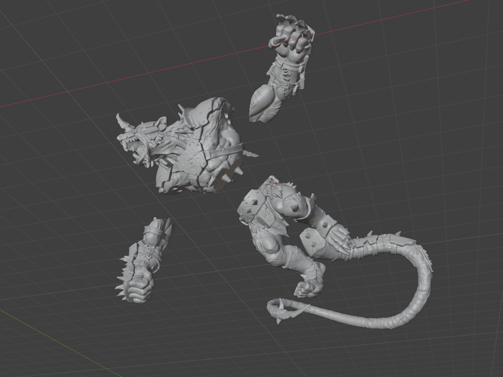
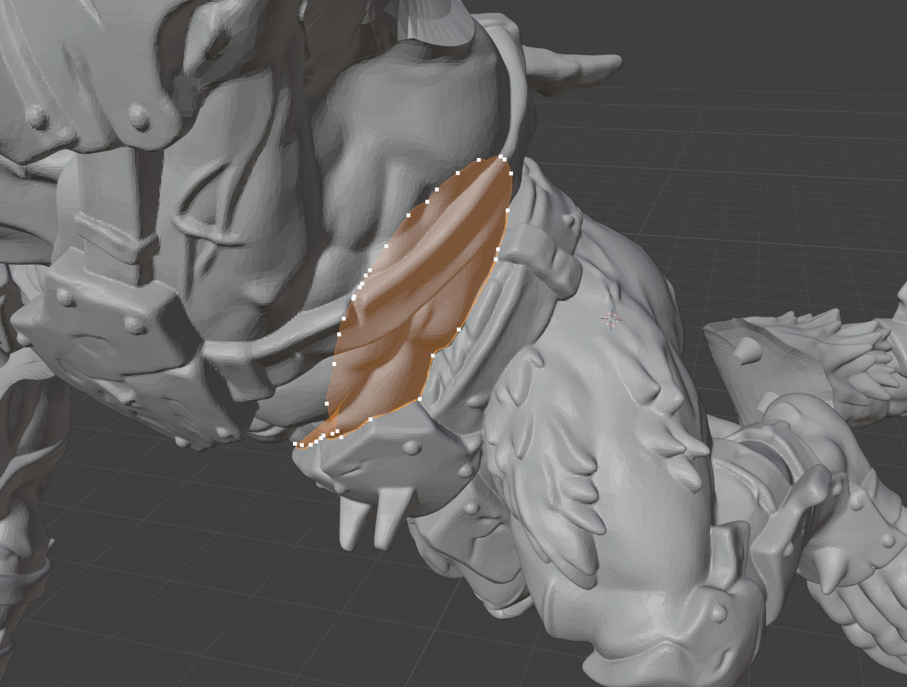
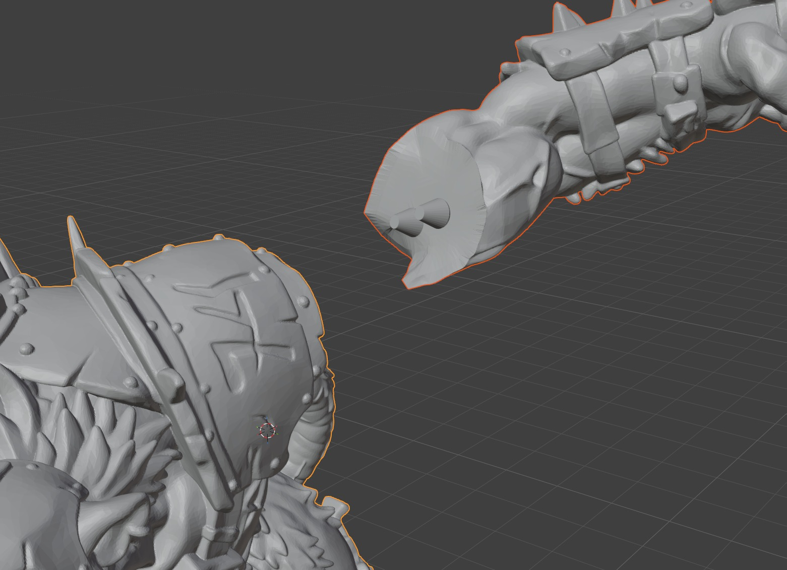
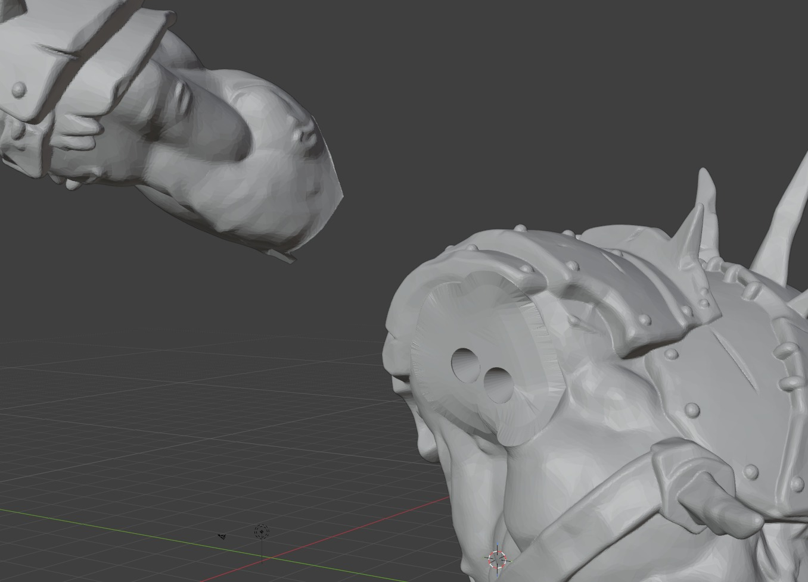
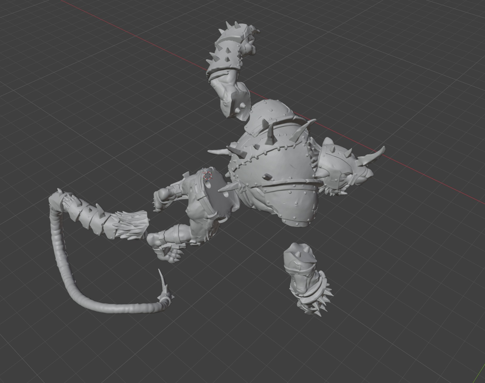

# PartPin — split models into printable parts

A free Blender add-on for cutting a model into 3D-printable parts. You draw
the perimeter of the cut straight onto the model, adjust it, and cut. Matching
**pin / socket connectors** hold the parts together, and the finished parts
export ready for slicing.

Works in **Blender 4.2+** on Windows, macOS and Linux. Needs a **closed,
manifold mesh** (as does every boolean-based cutter).



*A 441,616-face sculpt, cut into parts along lines drawn on it. Each cut takes
about three seconds.*

## Install

1. Download `part_pin-<version>.zip` from the
   [Releases page](https://github.com/matthewslade/PartPin/releases), or build
   it yourself:

   ```sh
   ./build.sh   # writes dist/part_pin-<version>.zip
   ```

2. In Blender: **Edit ▸ Preferences ▸ Add-ons ▸ ⌄ ▸ Install from Disk…** and
   pick the zip. **Restart Blender** if you are updating — Python keeps the old
   copy loaded otherwise.

3. The panel is in the 3D Viewport sidebar: press **N ▸ PartPin**.

## The short version

**Pick the model → Draw Cut on Model → adjust the line → press T → Create
Parts → Export.**

## 1. Pick the model

Set **Model** in the panel. **Check Mesh** confirms it is closed and manifold.
A stray edge or two in a dense sculpt is cut through anyway, with a warning —
the parts carry the same flaw out the other side, and a plain hole is usually
closed along with the seam. A properly open or broken mesh is refused, and
wants repairing first (Mesh ▸ Clean Up, Remesh, or the 3D-Print Toolbox add-on
that ships with Blender).

## 2. Draw the cut on the model

Hit **Draw Cut on Model** and draw the perimeter of the cut onto the surface.
Every position is ray-cast onto the model, so the line goes exactly where you
put it.

| Action | Result |
| --- | --- |
| Hold left mouse and draw | Lay the line onto the model |
| Let go, orbit, draw again | Carry on round the far side — the line joins up across the model, following its faces |
| Close at the green dot | Finish the loop and go straight to adjusting it |
| Enter | Close the loop from wherever you are |
| Backspace | Undo the last stretch |
| Esc | Cancel |

The green dot marks where you started, and turns yellow when you are close
enough to close on it. Corners are kept: a point lands on each corner you
draw, so a line round a boxy shape keeps its corners instead of being rounded
off.

**Or cut straight across** if that suits the model better — a **Straight** cut
plane you move and rotate like any object. It can then be edited on the surface
exactly like a drawn line.

## 3. Adjust the line on the model

Closing a drawn loop drops you straight in here; otherwise hit **Edit Cut on
Surface**. The cut object disappears and you get the line where the cut meets
your model, with draggable points on it, and the **shaded surface that will do
the cutting** drawn through the model.

| Action | Result |
| --- | --- |
| Drag a point | It slides along the surface; the two stretches of line either side of it are walked again across the model |
| Ctrl+Click | Add a point |
| X | Remove the point under the cursor |
| Alt+X | Remove a whole cut line |
| **T** | **Try the cut** on a copy and say whether it separates |
| Enter | Confirm |
| Esc | Revert |



*The orange line is where the cut will meet the model — on the surface, all the
way round. The white dots are the points you drag; the shaded patch is the lid
the cutter will actually build. Between your points the line is walked across
the model's own faces, taking the shortest way there is, so it holds the
contour you drew instead of cutting across it.*

Middle-mouse and the wheel still orbit and zoom, so you can spin the model
around while editing.

### The warnings

After every drag, the line is measured against your model and anything wrong
with it is marked where it is wrong. A line with nothing wrong is marked nothing
at all — and there is not much left that can be wrong with a line, because the
line is walked across the model's own surface and the cut is made along it.

| Mark | Meaning | What to do |
| --- | --- | --- |
| **Red** | The last attempt at this cut could not get through the surface there | Move the line off the crease, or take it a shorter way round |
| **Yellow** | The line has come off the model there | Drag those points back onto it |
| **Blue** | The line cannot get from one point to the next across the model | They are on pieces of the model that do not join up — move them onto one |
| **Pink** | The line doubles back on itself, with no room to cut between the two sides | Drag those points apart |

Red marks come from actually trying the cut — pressing **T**, or Create Parts
failing — so they show where it really got stuck rather than where it might.
They clear the moment the cut works. Before you see any, the cut has already
tried to mend itself: a seam only ever comes apart at one awkward spot, so the
cutter goes back over those spots with more to work with and tries again. What
is left in red is what that could not fix.

Press **T** at any point for a straight answer: *"This cut separates into 2
parts"*, or what is stopping it.

## 4. Connectors

With a cut active, **Add Connectors** places pins along it. They are ordinary
objects: move, rotate, scale, duplicate (Shift+D) or delete them.

- **Shape** — Cylinder, Tapered (self-centering, the default), Box
  (anti-rotation), or **Custom Mesh** (apply scale on your object first; its
  mesh is used as-is).
- **Clearance** — how much bigger the socket is than the pin. FDM printers
  usually want 0.1–0.3 mm. Print one and check before committing.
- **Flip Pin** — swap which part gets the pin and which the socket. Flipped
  pins turn blue (enable *Viewport Shading ▸ Color: Object* to see it).
- **Auto Size** — derive pin sizes from the model; it also happens by itself
  the first time you add connectors.
- **Snap Connectors** re-seats pins after you reshape a cut.



*The pin is unioned into one part…*



*…and a clearance-fattened copy of it is subtracted from the other, giving the
sockets. The two faces mate exactly: the seam is the line you drew, and nothing
is spent at it.*

## 5. Create Parts, and export

A finished part is a model in its own right: pick it in **Model** and cut it
again to get a large piece down to something the printer will take.

**Create Parts** applies every enabled cut, unions the pins into their parts
and subtracts clearance-fattened sockets from the mating parts. The parts land
in a new `<Model> Parts` collection; the original is kept hidden unless you
untick *Keep Original*. *Part Gap* moves the finished parts apart so you can
look at the seams.

**Export** writes STL, OBJ or FBX, one file per part or a single file. If you
model true-to-scale in metres, set *Scale* to 1000 so slicers — which read STL
units as millimetres — get the size right. If you already work at 1 unit =
1 mm, leave it at 1.

**Easy mode**, at the bottom of the panel, does cut → connectors → parts in one
click for simple models: pick an axis, then **Cut at Center** or **At Cursor**.



*Five cuts, five separations, every part closed and manifold — and between them
they still add up to exactly the model that went in.*

Cutting a dense model takes a few seconds, and a line that gives the cutter
trouble takes longer — so **Create Parts** reports as it goes, in the status bar
and in the panel: which cut, which attempt, and how far along. **Esc** stops it
and puts everything back exactly as it was.

## What the cut actually does

Your model's own surface is cut along the line you drew, the two sides of that
cut are parted, and each is capped with the same polygon. Nothing is invented
to cut with, so **the perimeter decides everything**: there is no plane to
flatten your line onto, and nothing reaching sideways into the model.

The seam is the line — not a surface fitted near it. The line itself is on the
model everywhere: between the points you place, it is walked across the
surface, taking the shortest way there is. Nothing at all is spent at the seam
either: the two parts add back up to exactly the model you started with, and
they mate face to face.

Only the material inside the line is cut. Draw round an arm at the armpit and
the arm comes away with the body left whole, even though the cut's plane would
carry on through it. Anything the line runs *across* — a strap, a fin — is cut
where it crosses, because that is what drawing the line over it asks for.

## Settings worth knowing

| Setting | What it does |
| --- | --- |
| **Points** | How many draggable points a new line gets (32). Corners always get one, so the count is a guide rather than a rule. More follow a drawn line more closely; fewer are easier to shove about |
| **Cut Inside Line Only** | On by default. Off cuts straight through on the flat plane closest to your line, splitting everything it meets |
| **Snap Connectors** | Re-seat a cut's pins on its surface whenever you finish editing it |

That is the lot. Cut Detail, Falloff and Undercut are gone: they existed to
manage a cut surface that no longer exists, and there is nothing left to
tune.

## Testing

The whole geometry side runs headless — no UI needed:

```sh
blender --background --python-exit-code 1 --python tests/smoke_test.py
```

367 checks over sixty-odd scenarios: the line and how it is walked across the
model, cutting along it on models from a cube to 441,800 faces, connectors,
drawing, the warnings and all three exporters — every one of them checking that
the parts come out closed and manifold and still add up to the model. On macOS
the binary is usually `/Applications/Blender.app/Contents/MacOS/Blender`.

## If a cut will not separate

Nothing is taken away when a cut fails: the model stays visible, the cut stays
where it is, and the spots it could not get through are marked in red on the
model. Open **Edit Cut on Surface** to see them and drag the line off them.

Press **T** at any point — it makes the cut on a copy and tells you what
happened, which beats guessing.

If the line still cannot be cut into the surface, **untick "Cut Inside Line
Only"**. That cuts straight through the model on the flat plane closest to your
line, which always produces two clean, closed parts. It takes more of the model
with the piece than the line asks for, which you can trim afterwards.

## Working on this

Three files carry the whole geometry side, and each opens with what it is for
and why it is built that way — the comments in them are the design notes:

- **`part_pin/walker.py`** — the shortest path across the model's surface
  between two points.
- **`part_pin/surface.py`** — the cut line: a ring of anchors on the model,
  with the walker filling in between them.
- **`part_pin/mesh_cut.py`** — the cutter: a band along the line, the model's
  own faces cut with it, the two sides parted and capped.

`CLAUDE.md` has the notes for anyone — or anything — working on the internals.

## Limits worth knowing

- A cut separates the piece the line rings off. Anything the line crosses is cut
  along with it, so draw round the piece rather than across what holds it.
- Cutting is exact but not instant: multi-million-poly meshes take a while. Cut
  before subdividing where you can.
- A line has to sit on one connected piece of the model. Two anchors on shells
  that do not join cannot be walked between, and the line says so.
- Drawing and dragging follow the visible surface, so orbit first to reach the
  far side.
- Modifiers on the model are baked into the parts.
- A line drawn round a *perfectly regular* tube — a plain extruded cylinder,
  where the line runs exactly along the mesh's own edges for whole stretches —
  can leave the seam a few loose ends. A sculpt's irregular triangulation does
  not run into it.

## License

MIT — see [LICENSE](LICENSE).
